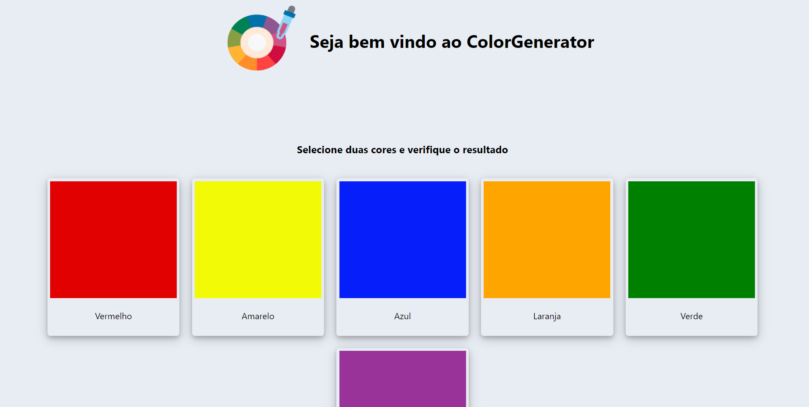

# ColorGenerator

**Número da Lista**: X 
**Conteúdo da Disciplina**: Grafos1 

## Alunos

| Matrícula  | Aluno                           |
| ---------- | ------------------------------- |
| 18/0122606 | Isadora Soares                  |
| 18/0042661 | Luís Fernando Furtado de Araújo |

## Sobre

O projeto tem como objetivo criar cores resultantes a partir de cores de origem. Para essa solução, foi implementado através do algoritmo de grafos estudado na disciplina. Basicamente, abstraímos como sendo um grafo bipartido com um lado sendo as cores de origem e do outro lado as cores resultantes.

## Screenshots

## Instalação

**Linguagem**: JavaScript 
**Framework**: ReactJS 

#### Clone o repositório

#### Instruções para rodar o projeto a primeira vez localmente

`Verificar se a versão do node na sua máquina se encontra na versão v16.15.1 para conseguir instalar as dependências.`

`npm install`

`npm start`

Após realizar esses passos, o site estará rodando na porta 3000.

## Uso

#### Para rodar o projeto a partir da segunda vez

`npm start`

Após realizar esses passos, o site estará rodando na porta 3000.

## Apresentação

Link da apresentação:
